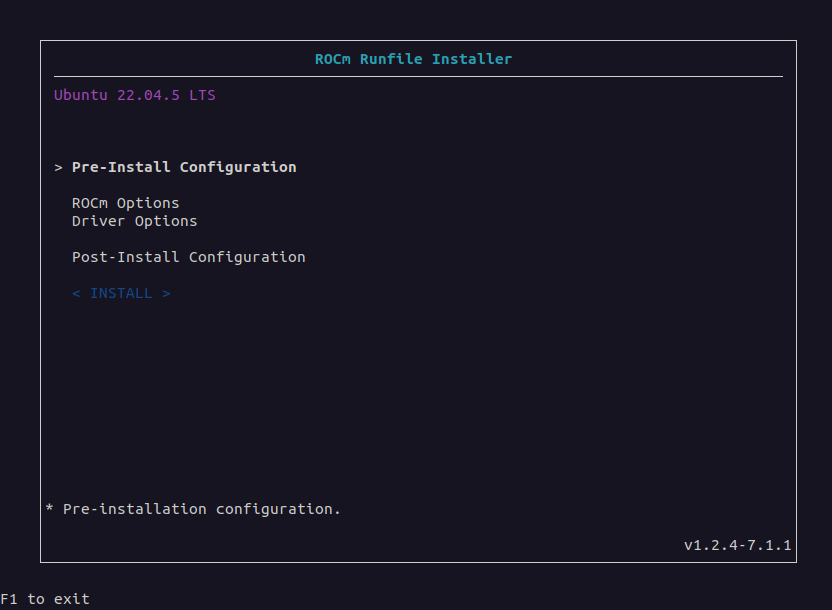
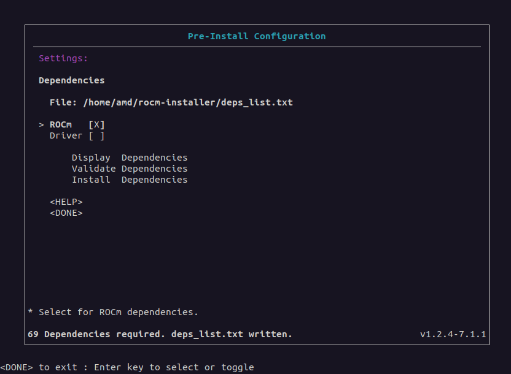
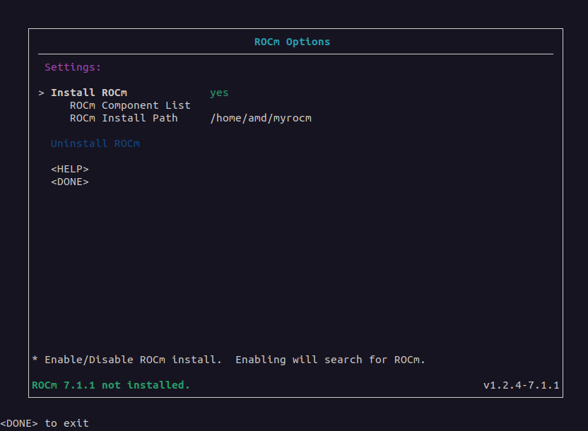
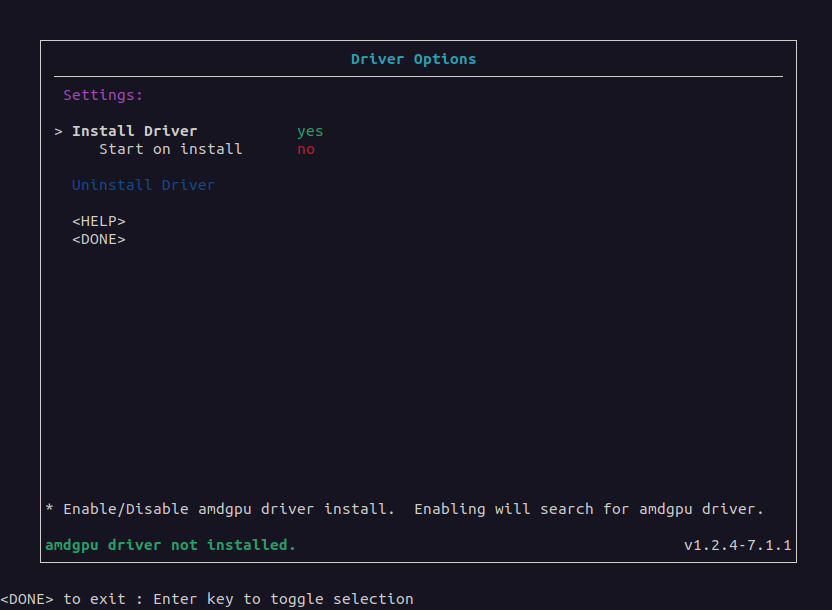
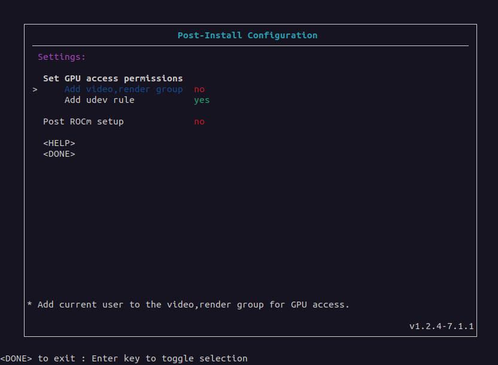

.. meta::
  :description: How to use the ROCm Runfile Installer
  :keywords: ROCm installation, AMD, ROCm, tools, Runfile installer

***************************************************************************
ROCm Runfile Installer
***************************************************************************

The ROCm Runfile Installer installs ROCm, the AMDGPU driver,
or a combination of the two on a system with or without
network or internet access. Unlike all other installation methods, the ROCm Runfile Installer
can install ROCm and the AMDGPU driver without using a native Linux package management system.

The key advantage of using the ROCm Runfile Installer is its offline installation support.
Many system environments have network or internet access restrictions, making installation via
normal package management difficult. Furthermore, some installation environments might also have general
restrictions on package management usage. Therefore, the ROCm Runfile Installer lets you perform
a completely self-contained ROCm software installation.

The ROCm Runfile Installer includes these features:

* An optional easy-to-use user interface for configuring the installation
* An optional command line interface for the installation
* Offline ROCm and AMDGPU driver installation (requires the prior installation of dependencies)
* Packageless ROCm and AMDGPU driver install without native package management
* A single self-contained installer for all ROCm and AMDGPU driver software
* Configurable installation location for the ROCm install
* Basic "tarball-like" extraction of ROCm content to a target location.

Prerequisites
================================================

The ROCm Runfile Installer requires the following configuration:

*  Installation of dependency requirements for the ROCm runtime
*  Installation of dependency requirements for the AMDGPU driver (optional)
*  Sufficient storage space for the installation (100 GB of free space)
*  A supported Linux distribution

.. _dependency-requirements:

Dependency requirements
================================================

The ROCm components contained within the ROCm Runfile installer have a specific set of libraries, frameworks, and other elements
that must be pre-installed on the system before you can use ROCm after the installation. Similarly, the
inclusion of the AMDGPU driver as part of the installation also requires specific libraries that must be pre-installed. ROCm Runfile installer users
must pre-install the list of required first-level dependencies.

To install the pre-install dependencies, use one of two methods:

*  Manual installation
*  The ROCm Runfile Installer

Manual installation
-----------------------------

You can determine the dependent packages from the ROCm
Runfile Installer **Pre-Install Configuration Settings** menu 
in the GUI or from the command line by using the ``deps=list rocm`` argument
for ROCm or the ``deps=list amdgpu`` argument for the AMDGPU driver. This list indicates all packages
required for the ROCm runtime or the AMDGPU driver. The required libraries, frameworks, and other components
within the required packages must be on the system when running ROCm or installing the AMDGPU driver.
Users can manually install the required packages in the list using any method. 

System administrators might prefer a manual installation process when deploying ROCm across a multi-node
cluster environment, where a base operating system image
is prepared and applied. This base OS image might have the dependency requirements pre-installed.

ROCm Runfile Installer
-----------------------------

For single-system environments, users can choose to have the ROCm Runfile Installer automatically install the
dependency requirements as part of the pre-installation stage for ROCm or the AMDGPU driver. Any missing dependency requirements can
be installed using the **Install Dependencies** option of the **Pre-Install Configuration Settings** menu
in the GUI or from the command line using the ``deps=install rocm`` or ``deps=install amdgpu`` argument.

.. note::

      The ROCm Runfile Installer requires a network or internet connection to install the dependency requirements.

Supported Linux distributions
================================================

The ROCm Runfile Installer tool supports the following Linux distributions and versions:

*  Ubuntu: 22.04, 24.04
*  RHEL: 8.10, 9.4, 9.6, 9.7, 10.0, 10.1
*  SLES: 15.7
*  Debian: 12, 13
*  Oracle Linux: 8.10, 9.6, 10.0
*  Rocky Linux: 9.6

Oracle Linux 8 and 9 use the corresponding RHEL 8 and 9 builds. Debian 12 and 13 use the Ubuntu 22.04 and 24.04 builds.
Rocky Linux 9 uses the RHEL 9 builds.
The following table maps the supported Linux distributions to the Runfile Installer builds they use:

.. csv-table::
   :header: "Linux distribution","Runfile build"
   :widths: 25,25

   "Ubuntu","Ubuntu"
   "RHEL","RHEL"
   "SLES","SLES"
   "Debian 12","Ubuntu 22.04"
   "Debian 13","Ubuntu 24.04"
   "Oracle Linux","RHEL"
   "Rocky Linux 9","RHEL 9"

Getting started
================================================

The ROCm Runfile Installer is distributed as a self-extracting ``.run`` file.
To install ROCm, launch the installer from any directory on the system.

Downloading the ROCm Runfile Installer
--------------------------------------

Download the ROCm Runfile Installer from `repo.radeon.com <https://repo.radeon.com/>`_ using the following command:

.. code-block:: shell

   wget https://repo.radeon.com/rocm/installer/rocm-runfile-installer/rocm-rel-<rocm-version>/<distro>/<distro-version>/<installer-file>

Substitute values specific to your installation for the following placeholders:

.. code-block:: shell

   <rocm-version>    = ROCm version number for the installer
   <distro>          = Linux distribution for the installer
   <distro-version>  = Linux distribution version for the installer
   <install-file>    = The installer .run file

For example, use this command to download ROCm 7.1.1 of the ROCm Runfile Installer for Ubuntu release 22.04:

.. code-block:: shell

   wget https://repo.radeon.com/rocm/installer/rocm-runfile-installer/rocm-rel-7.1.1/ubuntu/22.04/rocm-installer_1.2.4.70101-25-38~22.04.run

Running the ROCm Runfile Installer
----------------------------------

After downloading the ROCm Runfile Installer, run it from a terminal using
:ref:`gui-install` or :ref:`command-line-install`. See the sections below for more details. 

You can obtain help or version information using the following installer ``.run`` file argument options:

.. code-block:: shell

   bash rocm-installer.run help
   bash rocm-installer.run version

.. note::

   These commands use ``rocm-installer.run`` as a placeholder for the actual run file.
   Throughout the guide, substitute the name of the actual ``.run`` file for ``rocm-installer.run``.

Both the ``help`` and ``version`` commands run without extracting the installer contents.
Depending on the install method, they provide quick feedback on how to use the installer.
For all other argument options, or if no arguments are specified, the installer ``.run`` file self-extracts
to the current working directory where the ``.run`` file is executing.
The self-extraction process creates a new directory named ``rocm-install`` containing the content
and tools required for the installation. The ``rocm-install`` directory also includes a ``logs``
directory for recording the installation process.
For more information, see :ref:`log-files` below.

.. note::

   The installer self-extraction process might take a significant amount of time due to the size of the installer content and the decompression process.

Install methods
================================================

The ROCm Runfile Installer provides two methods for running the ROCm installation:

*  :ref:`gui-install`: The GUI installation includes a visual interface for configuring the installation,
   letting you specify the pre- and post-installation requirements. In addition, the GUI provides
   feedback and guidance for setting up the installation. This method is recommended for new
   and intermediate installer users.
*  :ref:`command-line-install`: The command line interface installation method provides a direct terminal-based approach for
   configuring and running the installation. This method is recommended for more advanced installer users.

.. _gui-install:

GUI install
================================================

Launch the GUI-based installation of the ROCm Runfile Installer from the terminal command line without arguments as follows:

.. code-block:: shell

   bash rocm-installer.run

GUI
---

Use the Runfile Installer GUI to configure the installation, from the pre- to post-install options.

Starting from the **Main** menu, the user interface contains multiple menus and sub-menus for each stage
of the installation process.

Main menu
^^^^^^^^^

The **Main** menu is the installation starting point.

Pre-Install Configuration Settings menu
^^^^^^^^^^^^^^^^^^^^^^^^^^^^^^^^^^^^^^^

The **Pre-Install Configuration Settings** menu is an optional menu used to configure pre-installation
requirements before installation. The pre-installation settings relate to the dependent libraries
and packages required by the ROCm runtime or the AMDGPU driver. 

*  **File**

   **File** displays the location of the ``deps_list.txt`` file. This file is based
   on the combination of selected dependencies using the **ROCm** and **Driver** checkboxes and either
   **Display Dependencies** or **Validate Dependencies**. If **Display Dependencies** is selected, ``deps_list.txt``
   includes a list of all required dependencies. If **Validate Dependencies** is selected,
   ``deps_list.txt`` contains only the missing dependencies on the system that still require installation.
   The **File** field is initially blank until **Display Dependencies** or **Validate Dependencies** is selected.

*  **ROCm** / **Driver**

   The **ROCm** and **Driver** checkboxes are used to select which dependencies you want to display, validate, or install.

*  **Display Dependencies**

   **Display Dependencies** lists all required (Debian or RPM) packages that must be pre-installed on the system.
   These packages are required by ROCm or the AMDGPU driver being installed by a particular ROCm Runfile Installer version.

   .. note::

      The required packages are listed in the ``deps_list.txt`` file and can be installed separately from the ROCm Runfile Installer.

*  **Validate Dependencies**

   **Validate Dependencies** verifies which required packages are currently installed on the system where
   ROCm or the AMDGPU driver is being installed. It displays which packages from the required packages list are missing.

   .. note::

      The missing packages are listed in the ``deps_list.txt`` file. 

*  **Install Dependencies**

   If the installer is running on the system where ROCm or the AMDGPU driver will be installed, you can choose to install
   any missing dependencies using the **Install Dependencies** option.

   .. note::

      **Install Dependencies** is only intended for a system with network or internet access. For offline installation
      using the ROCm Runfile Installer, you must manually install the required packages.
      For more details, see the :ref:`dependency-requirements` section.

ROCm Options menu
^^^^^^^^^^^^^^^^^^^^^^^^^^^^^^

The **ROCm Options** menu can include or exclude ROCm from the installation.

*  **Install ROCm**

   This field indicates whether to include ROCm components in the installation. If this field is set to ``yes``, 
   ROCm installation is enabled and the Runfile Installer searches the system for any existing ROCm installations.
   If a previous ROCm installation is detected, the **Uninstall ROCm** field becomes selectable.

*  **ROCm Component List**

   If **Install ROCm** is set to ``yes``, this field displays a list of all ROCm components and component versions
   included in the installation.

*  **ROCm Install Path**

   If **Install ROCm** is set to ``yes``, the **ROCm Install Path** field can set the full path to
   the directory where ROCm will be installed. The default location is ``/``, which is the typical ``/opt/rocm``
   ROCm installation location.

   When **ROCm Install Path** is set to a new path, the installer validates the new directory location.
   If the directory exists, the ROCm installation can proceed. If an invalid location is specified,
   the ROCm installation will not be allowed. 

*  **Uninstall ROCm**

   This field is only available if previous Runfile ROCm installations are discovered on the system
   where ROCm is being installed, based on the currently selected **ROCm Install Path** location.
   The installer only lists previous installation locations that are on the current install path.
   If any installation locations are present on this path, they can be selected for uninstall.
   The installer indicates the type of installation as follows:

   *  **P** (Package manager): Package manager installation that matches the ROCm version for the Runfile Installer. In this case, uninstall is not allowed.
   *  **C** (Runfile conflict): Runfile installation that matches the ROCm version for the Runfile Installer. The conflicting installation can be uninstalled.
   *  **R** (Runfile): Runfile installation that differs from the ROCm version for the Runfile Installer. The installation can be uninstalled.
   
   **Uninstall ROCm** is for a single ROCm instance at a time and is only available for Runfile installs.
   Package manager installs of ROCm cannot be uninstalled by the Runfile installer and must be uninstalled manually
   using the package management application.

   .. image:: ../data/how-to/rocm-runfile-rocm-menu-uninstall-3b.png
      :width: 800
      :alt: The ROCm Uninstall user interface menu for the ROCm Runfile Installer

Driver Options menu
^^^^^^^^^^^^^^^^^^^^^^^^^^^^^^

The **Driver Options** menu can include or exclude the AMDGPU driver from the installation.

*  **Install Driver**

   This field indicates whether to include the AMDGPU driver in the installation. If this field is set to ``yes``,
   AMDGPU driver installation is enabled. When this field is enabled, the system is searched for any existing
   AMDGPU driver installations. If a previous AMDGPU driver installation is detected, the **Uninstall Driver** field becomes selectable.
   
   .. note::
      
      The AMDGPU driver is installed for the currently running Linux kernel version. To install the AMDGPU driver for a different kernel,
      reboot to the specific Linux kernel and reinstall AMDGPU using the runfile.

*  **Start on install**

   If the **Start on install** option is enabled, the Runfile installer uses ``modprobe`` to automatically launch
   the AMDGPU driver after installation. If a pre-existing AMDGPU driver is already loaded on the system, the new driver will not start.
   This option can be useful for installing the driver on a system where the GPU device is newer and not yet natively
   supported as part of the upstream GPU driver for the Linux distribution.

*  **Uninstall Driver**

   This field is only available if a previous Runfile install of the AMDGPU driver is discovered on the install system.
   If a Runfile installation of the AMDGPU driver is detected, select **Uninstall Driver** to remove it.
   Package manager installs of the AMDGPU driver cannot be uninstalled by the Runfile installer and must be 
   uninstalled manually using the package management application.

Post-Install Options menu
^^^^^^^^^^^^^^^^^^^^^^^^^^^^^^

Use the **Post-Install Options** menu to optionally enable additional setup and configuration items
after the initial ROCm install.

*  **Set GPU access permissions**

   This section sets the GPU access permissions after the ROCm installation.
   Typically, any ROCm component using the GPU and requiring access to GPU resources
   needs to set the access permission. For ROCm, GPU access is controlled by membership in
   the ``video`` and ``render`` groups. Membership and access to GPU resources can be set using one of two methods.

   *  **Add video,render group**

      If the **Add video,render group** field is enabled, the current ``$USER`` is added to the groups
      and will be granted GPU access.

   *  **Add udev rule**

      If the **Add udev rule** field is enabled, GPU access is granted to all users on the system.

   .. note::

      It's **recommended** that you enable one of the GPU access options for using ROCm.

      Only one method for adding GPU access can be selected.
 
*  **Post ROCm setup**

   When this option is enabled, the ROCm post-install setup is performed. This includes configuring
   symbolic links and other system requirements for using ROCm and the ROCm runtime.

   .. tip::

      It's recommended that you enable the **Post ROCm setup** to guarantee proper 
      functioning of the ROCm components and applications. However, advanced users 
      who understand the ROCm setup might want to disable this option so they can control the 
      post-installation ROCm setup for their specific environment.

Using the GUI
-----------------

Start the ROCm Runfile Installer user interface from the terminal and launch the **Main** menu.
While navigating through the user interface menus, use the **Done** option to return to the previous menu.
Some menus have a **Help** option to display more information about the elements within the current menu.

Follow these steps to install ROCm and the AMDGPU driver:

#. **(Optional)** Install dependencies:

   a. Enter the **Pre-Install Configuration** menu.
   b. Select the **ROCm** checkbox, **Driver** checkbox, or both to specify the dependency type.
   c. If using the installer to install missing required dependencies, select **Install Dependencies**.

      To manually install the required dependencies, select **Display Dependencies** to list
      all the dependencies or **Validate Dependencies** to only list the missing dependencies on the
      current system. Quit the installer using **DONE->F1** and separately install the required dependencies,
      which will be listed in the ``deps_list.txt`` file at the **File** location.
      After completing this task, restart the ROCm Runfile Installer and proceed to step 2.

#. Set the ROCm options:

   a. Enter the **ROCm Options** menu.
   b. Set **Install ROCm** to **yes** to include ROCm components in the installation.
   c. **(Optional)** Select **Uninstall ROCm** to uninstall a previous Runfile installation.
   d. Leave the **ROCm Install Path** field set to the default location to install ROCm
      to ``/opt/rocm`` or set the install location to a valid existing directory.

#. Set the AMDGPU driver options:

   a. Enter the **Driver Options** menu.
   b. Set **Install Driver** to **yes** to include the AMDGPU driver in the installation.
   c. **(Optional)** Select **Start on install** to load the driver after installation.
   d. **(Optional)** Select **Uninstall Driver** to uninstall a previous Runfile installation.

#. Set the post-install options:

   a. Set the method of enabling permission for GPU access to **Add video,render group** or **Add udev rule**.
   b. Set **Post ROCm setup** to **yes** to include post-install ROCm setup configuration.
 
.. _command-line-install:

Command line install
================================================

The command line install interface can be used as an alternative to the menu-based ROCm Runfile Installer GUI
to reduce user interaction during the installation.

Run the ROCm Runfile Installer from the terminal command line as follows:

.. code-block:: shell

   bash rocm-installer.run <options>

The ``<options>`` parameter can be set to these options:

*  User help/information
  
   *  ``help``: Displays information on how to use the ROCm Runfile Installer.
   *  ``version``: Displays the current version of the ROCm Runfile Installer.

*  Runfile options

   *  ``noexec``: Disable all installer execution. Extract the ``.run`` file content only.
   *  ``noexec-cleanup``: Disable cleanup after installer execution. Keep all ``.run`` extracted and runtime files.

*  Runfile extraction options

   *  ``untar <directory>``: Extract only the ROCm installation components from the ``.run`` file tarball to ``<directory>``.
   *  ``untar <directory> verbose``: Extract only the ROCm installation components from the ``.run`` file tarball to ``<directory>`` and
      verbosely list the files that are processed.

*  Dependencies

   *  ``deps=<arg> <compo>``:

      *  ``<arg>``:

         *  ``list <compo>``: Lists the required dependencies for the install ``<compo>``.
         *  ``validate <compo>``: Validates which required dependencies are installed or not installed for ``<compo>``.
         *  ``install-only <compo>``: Installs the required dependencies only for ``<compo>``.
         *  ``install <compo>``: Installs with the required dependencies for ``<compo>``.
         *  ``file <file-path>``: Installs with the dependencies from a dependency configuration file with path ``<file_path>``.
         *  ``file-only <file-path>``: Install the dependencies from a dependency configuration file with path ``<file_path>`` only.

      *  ``<compo>``: Install component (``rocm``/``amdgpu``/``rocm amdgpu``).

*  Install

   *  ``rocm``: Enable ROCm components install.
   *  ``amdgpu``: Enable AMDGPU driver install.
   *  ``force``: Force the ROCm and AMDGPU driver install.
   *  ``target=<directory>``: The target directory path for the ROCm components install.
       
*  Post-install

   *  ``postrocm``: Run the post-installation ROCm configuration (for instance, script execution and symbolic link creation).
   *  ``amdgpu-start``: Start the AMDGPU driver after the install.
   *  ``gpu-access=<access_type>``

      *  ``<access_type>``:

         *  ``user``: Adds the current user to the ``render,video`` group for GPU access.
         *  ``all``: Grants GPU access to all users on the system using ``udev`` rules.

*  Uninstall

   *  ``uninstall-rocm (target=<directory>)``: Uninstall ROCm.

      *  (``target=<directory>``): Optional target directory for the ROCm uninstall.

   *  ``uninstall-amdgpu``: Uninstall the AMDGPU driver.

*  Information/Debug

   *  ``findrocm``: Search for a ROCm installation.
   *  ``complist``: List the version of ROCm components included in the installer.
   *  ``prompt``: Run the installer with user prompts.
   *  ``verbose``: Run the installer with verbose logging.

.. note::

   The installer can be used with multiple ``<options>`` combinations to enable specific stages of the
   ROCm install process (pre-installation and post-installation). The exception is any option that uses the 
   keyword ``-only`` will apply that option only and no others. Some
   informational options are also single-option commands. These options are described in more detail below.

This example demonstrates how to perform a typical ROCm installation on a single target system with 
the required dependencies installed, the ROCm install directory set to ``/myrocm``, GPU access set
to ``udev``, and with the post-install setup:

.. code-block:: shell

   bash rocm-installer.run deps=install target="/myrocm" rocm gpu-access=all postrocm

This example demonstrates how to perform a typical AMDGPU driver installation on a single target system
with the required dependencies installed:

.. code-block:: shell

   bash rocm-installer.run deps=install amdgpu

Finally, you can combine the ROCm and AMDGPU driver installations:

.. code-block:: shell

   bash rocm-installer.run deps=install target="/myrocm" rocm amdgpu gpu-access=all postrocm

Command line interface
-----------------------

The command line interface for the ROCm Runfile Installer is based on the
``<options>`` list provided to the installer ``.run`` file.

Runfile options
^^^^^^^^^^^^^^^^^^

The ROCm Runfile Installer is a self-extracting ``.run`` file with a few options for controlling the extraction process.
When the installer ``.run`` file starts execution, the extraction process begins with a checksum validation to verify
the integrity of the ``.run`` file. If there are no errors, it begins extracting and decompressing the package contents.
The contents are output to a new directory named ``rocm-installer``, located in the current working directory.   

Usually, when extraction and decompression are complete, execution begins automatically by either starting up the GUI
(if no arguments are provided) or executing the ``rocm-installer.sh`` script with all command line arguments.
The ``rocm-installer.sh`` script is in the extracted ``rocm-installer`` directory.

When the GUI exits or the command line completes execution, the Runfile installer will automatically clean up the
``rocm-installer`` directory and delete all content except for the log files and the ``deps_list.txt`` file.

In some cases, you might want to execute multiple commands from the same extraction and save the time required
to verify the checksum and extract and decompress the package contents of the ``.run`` file. 
Two command line options let you disable the ``.run`` cleanup process: ``noexec`` and ``noexec-cleanup``.

*  ``noexec``

   The ``noexec`` option is a single command line argument that lets the checksum and extraction process complete
   and then exits without starting the GUI or executing the ``rocm-installer.sh`` script.
   All content will be maintained after the exit. You can then use the ``rocm-installer.sh`` script directly from the
   command line without specifying the ``.run`` file name.

   For example, extract the ``.run`` file and then use ``rocm-installer.sh`` instead of ``rocm-installer.run``
   to install ROCm and the AMDGPU driver separately:

   .. code-block:: shell

      bash rocm-installer.run noexec
      cd rocm-installer
      bash rocm-installer.sh rocm
      bash rocm-installer.sh amdgpu

   .. note::

      If the ``noexec`` option is used, all other ``<options>`` on the command line will be ignored.

*  ``noexec-cleanup``

   The ``noexec-cleanup`` option disables the cleanup process after the GUI or command line interface exits.
   Unlike the ``noexec`` option, all command line arguments are processed as normal,
   but no content is deleted upon exit or completion. At this point, you can switch to using the
   ``rocm-installer.sh`` script within the ``rocm-installer`` directory to avoid re-extracting the contents.

Runfile extraction options
^^^^^^^^^^^^^^^^^^^^^^^^^^

The ROCm Runfile Installer extraction process can be run manually to generate a "tarball-like" extraction of only the ROCm component contents.
The ``untar`` operation mode bypasses all checksum and installer execution and only outputs the ROCm content to a user-specified directory.
Specifically, this mode of operation allows users without system administrator (``sudo``) access to easily set up ROCm in local "home" directories.
System administrator access is typically required to use the Runfile Installer otherwise.

Basic extraction is performed using the ``untar`` command line option:

*  ``untar <directory>``
*  ``untar <directory> verbose``

   The ``untar`` option is a command-line argument that extracts the ROCm component contents to the specified ``<directory>`` location.
   The output ``<directory>`` must be an absolute or relative path to a pre-existing directory on the system.
   The optional ``verbose`` argument can be added to the ``untar`` option to output the list of files being extracted.

   For example, to untar the ROCm content to a user directory called ``amd/myrocm``, the command line is as follows:

   .. code-block:: shell

      bash rocm-installer.run untar /home/amd/myrocm 

   For verbose extraction, the command line is as follows:

   .. code-block:: shell

      bash rocm-installer.run untar /home/amd/myrocm verbose

   After the untar extraction process completes, the content is written to a new ``rocm-version`` directory within the specified ``<directory>``.
   The ``rocm-version`` directory is named according to the version of ROCm included in the Runfile Installer.
   For example, if the ROCm 7.1.1 Runfile Installer is extracted using the ``untar`` command, the output directory is named ``rocm-7.1.1``.

   The extracted ROCm directory only contains the content for ROCm components and is not configured using the standard ROCm post-installation procedure.
   Advanced users might want to configure the ROCm content manually. However, as an option for some users, the ``untar``
   command auto-generates a script that can be used for basic ROCm post-install configuration as part of the untarring process.
   The ``setup-modules`` script is generated and located in the root ``rocm-version`` directory.  

   For example, after untarring ROCm 7.1.1 to the ``amd/myrocm`` user directory, the script can be found in the following location: 

   .. code-block:: shell

      /home/amd/myrocm/rocm-7.1.1/setup-modules-7.1.1.sh

   .. note::

      The ``setup-modules`` script requires system administrator access to execute and, therefore, might not be suitable for all users
      using the ``untar`` command line option.

   The ``setup-modules`` script sets up a ROCm module in the specified ``<directory>`` using ``environment-modules``, which are installed when the script is run.
   After the ``setup-modules`` script has set up the ``environment-modules`` and additional symbolic links,
   the associated ROCm module can be loaded, allowing it to be used as part of ROCm. To set up and load the ROCm module for an ``untar`` extraction,
   where ``<version>`` is the Runfile Installer ROCm version, use the following steps:

   .. code-block:: shell

      cd <directory>/rocm-<version>
      ./setup-modules-<version>.sh
      source /etc/profile.d/modules.sh
      module load rocm/<version>

   For example, for a ROCm 7.1.1 Runfile Installer ``untar`` extraction to the ``amd/myrocm`` user directory, use the folllowing commands to
   set up and load a ROCm module:

   .. code-block:: shell

      cd /home/amd/myrocm/rocm-7.1.1
      ./setup-modules-7.1.1.sh
      source /etc/profile.d/modules.sh
      module load rocm/7.1.1

   After the ROCm module is loaded, ROCm is functionally ready for use, provided all ROCm dependencies have been installed on the system.
   See the :ref:`dependency-requirements` section for more details on how to install ROCm dependencies that are not already installed.

Dependency options
^^^^^^^^^^^^^^^^^^

Like the GUI **Pre-Install Configuration** menu, the command line interface can list,
validate, and install the required dependencies. At the command line, add the ``deps=<arg> <compo>`` option to the
list of ``<options>`` for the ``.run`` file. The ``<compo>`` option can include any combination of the
``rocm`` and ``amdgpu`` tags.

*  ``deps=list <rocm/amdgpu>``

   This dependency option lists all the dependencies required for the ``.run`` file-based ROCm installation,
   AMDGPU installation, or both. It lists all required (Debian or RPM) packages that require pre-installation on the system.
   The additional ``rocm`` or ``amdgpu`` parameter is a requirement for the ``deps=list`` option that instructs the installer to list only the
   dependencies required by ROCm, the AMDGPU driver, or both.

   Running ``deps=list`` causes the installer to quit after listing the dependencies. ``deps=list``
   can combine ``rocm`` and ``amdgpu`` and output the combined list of required dependencies.

   Use ``deps=list <rocm/amdgpu>`` as a single ``<options>`` parameter:

   .. code-block:: shell

      bash rocm-installer.run deps=list rocm
      bash rocm-installer.run deps=list amdgpu
      bash rocm-installer.run deps=list rocm amdgpu

   .. note::

      The list of required packages can be installed separately from the Runfile Installer.

*  ``deps=validate <rocm/amdgpu>``

   This dependency option verifies whether any of the *required* ROCm or AMDGPU driver packages in the
   dependency list are already installed on the system running the command.
   The output is a list of any missing dependency packages that require installation.

   Running ``deps=validate`` causes the installer to quit after listing the missing dependencies.
   ``deps=validate`` can combine ``rocm`` and ``amdgpu`` and output the combined list of missing dependencies.

   Use ``deps=validate <rocm/amdgpu>`` as a single ``<options>`` parameter:

   .. code-block:: shell

      bash rocm-installer.run deps=validate rocm
      bash rocm-installer.run deps=validate amdgpu
      bash rocm-installer.run deps=validate rocm amdgpu

   .. note::

      The list of missing packages can be installed separately from the Runfile Installer.

*  ``deps=install``

   This dependency option validates and installs any required packages in the dependency list for
   ROCm, the AMDGPU driver, or both that are missing on the system running the command. This dependency option is not
   a single ``<options>`` parameter and can be added to a list of other options for the installer.
   The ``deps=install`` option expects at least one of the ``rocm`` or ``amdgpu`` ``<options>`` parameters to also be present in the list
   to enable the pre-installation of required dependencies before the Runfile Installer installs ROCm,
   the AMDGPU driver, or both.

   For example, to install the dependencies and ROCm, the command line is as follows:

   .. code-block:: shell

      bash rocm-installer.run deps=install rocm

   To install the dependencies and the AMDGPU driver, the command line is as follows:

   .. code-block:: shell

      bash rocm-installer.run deps=install amdgpu

   To install the dependencies and both ROCm and the AMDGPU driver, the command line is as follows:

   .. code-block:: shell

      bash rocm-installer.run deps=install rocm amdgpu

   .. note::

      The installer can be set to *only* install the ROCm dependencies, AMDGPU dependencies, or both and then quit. In this case,
      add ``-only`` to the ``deps=install`` option:

      .. code-block:: shell

         bash rocm-installer.run deps=install-only rocm
         bash rocm-installer.run deps=install-only amdgpu
         bash rocm-installer.run deps=install-only rocm amdgpu

*  ``deps=file <file-path>``

   This dependency option specifies the name of a input file for the installer. This file contains a custom list of
   dependency packages to install. The list must have as the same format
   as the output of the ``deps=list`` option. Specify each (Debian or RPM) package by name,
   one package per line. ``<file-path>`` is the second parameter, which indicates the absolute path to the dependency file.

   For example, to install the dependencies listed in a file named ``mydeps.txt`` as part of a ROCm install,
   the command line is as follows:

   .. code-block:: shell

      bash rocm-installer.run deps=file /home/amd/mydeps.txt

   .. note::

      The installer can be set only to install the dependencies file and then quit. In this case, add
      ``-only`` to ``deps=file``.

      .. code-block:: shell

         bash rocm-installer.run deps=file-only /home/amd/mydeps.txt

Install options
^^^^^^^^^^^^^^^

Like the GUI **ROCm Options** menu, the ROCm Runfile Installer can be configured to install ROCm,
which can be installed in a specific location.

*  ``rocm``

   At the command line, add the ``rocm`` option to enable ROCm installation.

   .. note::

      This option must be in the list of ``.run <options>`` for ROCm component installation.
      The AMDGPU driver is installed for the currently running Linux kernel version. To install the AMDGPU driver for a different kernel,
      reboot to the specific Linux kernel and reinstall AMDGPU using the runfile.

   For example, to install ROCm with no other options, the command line is as follows:

   .. code-block:: shell

      bash rocm-installer.run rocm

*  ``target=<directory>``

   This install option is used to set the target directory where ROCm will be installed.
   The ``target`` option is only used as an option for ROCm installation and is not required for an AMDGPU driver install.

   When ``target=<directory>`` is not specified in the ``<options>`` list, the installer uses a default installation path for ROCm.
   For the command line interface method, the default install directory is ``$PWD``.
   This is the current working directory where you launched the installer.
   In this configuration, the installer creates a new directory inside ``$PWD`` named ``rocm``
   and installs all ROCm components to this location.

   The user can change the default location and set the ROCm component installation directory using
   the ``target=<directory>`` option. The ``<directory>`` argument must be a valid and absolute path to
   a directory on the system executing the ROCm Runfile Installer.

   For example, to install ROCm to the usual ``/opt/rocm`` location, the command line is as follows:

   .. code-block:: shell

      bash rocm-installer.run target="/" rocm

   To install ROCm to a directory called ``amd/myrocm`` in the ``$USER`` directory,
   the command line is as follows:

   .. code-block:: shell

      bash rocm-installer.run target="/home/amd/myrocm rocm"

*  ``amdgpu``

   At the command line, add the ``amdgpu`` option to enable AMDGPU driver installation.

   .. note::

      This option must be in the list of ``.run <options>`` for AMDGPU driver installation.

   For example, to install the AMDGPU driver with no other options, the command line is as follows:

   .. code-block:: shell

      bash rocm-installer.run amdgpu

   .. note::

      Both ``rocm`` and ``amdgpu`` can be combined in the ``<options>`` list to install both components.
      For this case, the command line is as follows:

      .. code-block:: shell

         bash rocm-installer.run rocm amdgpu

*  ``force``

   The ``force`` install option can be added to the ``<options>`` list for the case of multiple
   pre-existing Runfile installs of ROCm. Add this option to disable any installer prompts that ask
   for confirmation to continue with the ROCm install if there are currently one or more Runfile
   ROCm installations already on the system.

Post-install options
^^^^^^^^^^^^^^^^^^^^

Similar to the GUI **Post-Install Options** menu, the post-install options can configure the ROCm Runfile Installer
to apply additional post-installation options after completing the installation.
At the command line, add one or more of the post-installation options to the ``<options>`` list for the ``.run`` file.

*  ``postrocm``

   This post-install option applies any post-installation configuration settings for ROCm following installation on the target system.
   The post-installation configuration includes any symbolic link creation, library configuration, and script execution
   required to use the ROCm runtime.

   To enable the ROCm post-install configuration, add ``postrocm`` to the ``<options>`` list at the command line.

   For example, to enable ROCm post-installation configuration for a ROCm installation to the ``/`` directory,
   the command line is as follows:

   .. code-block:: shell

      bash rocm-installer.run target="/" rocm postrocm

   If the ``postrocm`` option was not included as part of the initial ROCm install command,
   the post-installation task can still be run separately after the installation.
   To run the ROCm post-installation operation from the command line, use the ``postrocm`` argument
   in conjunction with ``target=rocm-install-path``, where ``rocm-install-path`` is the
   location of the Runfile-installed ROCm installation. The ROCm installation version and 
   the Runfile Installer version must match.
   For example, if the current Runfile Installer is for ROCm 7.1.1, then
   ``rocm-install-path`` must indicate the path to a ROCm 7.1.1 Runfile installation.
   
   To use the ``postrocm`` argument separately from the initial install of ROCm 7.1.1
   to ``/home/amd/myrocm``, run:

   .. code-block:: shell

      bash rocm-installer.run target="/home/amd/myrocm/rocm-7.1.1" postrocm

   .. note::

      Adding the ``postrocm`` option to the ``<options>`` list is highly recommended to guarantee proper functioning
      of the ROCm components and applications.

*  ``gpu-access=<access_type>``

   This post-install option sets the GPU resource access permissions. ROCm runtime libraries and applications
   might need access to the GPU. This requires setting the access permission to the ``video`` and ``render`` groups
   using the ``<access_type>``.

   If the ROCm installation is for a single user, then set the ``<access_type>`` for the ``gpu-access`` option to ``user``.

   For example, to add the current user (``$USER``) to the ``video,render`` group for GPU access
   for a ROCm installation, the command line is as follows:

   .. code-block:: shell

      bash rocm-installer.run rocm gpu-access=user

   In cases where a system administrator is installing ROCm for multiple users, they might want to enable
   GPU access permission for all users. For this case, set the ``<access_type>`` for the ``gpu-access`` option to ``all``:

   .. code-block:: shell

      bash rocm-installer.run rocm gpu-access=all

   .. note::

      Adding the ``gpu-access`` option to the ``<options>`` list is recommended for using ROCm. A typical ROCm installation
      includes both the ``postrocm`` option and one of the ``gpu-access`` types.

Uninstall options
^^^^^^^^^^^^^^^^^

These options configure the ROCm Runfile Installer to uninstall a previous ROCm or AMDGPU driver installation.

*  ``uninstall-rocm (target=<directory>)``

   This option configures the ROCm Runfile Installer to uninstall a previous ROCm installation.

   The parameter ``target=<directory>`` is optional for the ``uninstall-rocm`` option. If it's set, the uninstall looks for a
   pre-existing ROCm installation at the specified directory path and attempts to remove it.

   To uninstall ROCm from the default location (``$PWD/rocm``), use the following command line:

   .. code-block:: shell

      bash rocm-installer.run uninstall-rocm

   .. note::

      This command matches the case where ROCm was installed without the ``target=<directory>`` option.
      To uninstall ROCm from a specific location, append ``target=<directory>``. For example, if ROCm was previously
      installed to ``/home/amd/myrocm``, use the following command line:

      .. code-block:: shell

         bash rocm-installer.run uninstall-rocm target="/home/amd/myrocm"

   .. note::

      The ``uninstall-rocm`` option can only remove ROCm if it was installed using the ROCm Runfile Installer.
      Traditional package-based ROCm installs will not be removed.

*  ``uninstall-amdgpu``

   This option configures the ROCm Runfile Installer to uninstall a previous AMDGPU driver installation.

   To uninstall the AMDGPU driver from the system, use the following command line:

   .. code-block:: shell

      bash rocm-installer.run uninstall-amdgpu

   .. note::

      The ``uninstall-amdgpu`` option can only remove the AMDGPU driver if it was installed using the ROCm Runfile Installer.
      Traditional package-based AMDGPU driver installs will not be removed.

Information and debug options
^^^^^^^^^^^^^^^^^^^^^^^^^^^^^

The ROCm Runfile Installer command line interface includes options for information output or debugging.

*  ``findrocm``

   This information option searches the install system for any existing installations of ROCm.
   Any install locations are output to the terminal.

   Use ``findrocm`` as a standalone ``<options>`` parameter:

   .. code-block:: shell

      bash rocm-installer.run findrocm

*  ``complist``

   This information option lists the version of each ROCm component included in the installer.
   The ``complist`` option causes the Runfile Installer to quit after listing the ROCm components.

   Use ``complist`` as a standalone ``<options>`` parameter:

   .. code-block:: shell

      bash rocm-installer.run complist

*  ``prompt``

   This debug option enables user prompts in the installer. At specific, critical points of the installation process,
   the installer halts execution and prompts the user to either continue with the install or exit.

*  ``verbose``

   This debug option enables verbose logging during ROCm Runfile Installer execution.

   For example, to install ROCm with user prompts and verbose logging, the command line is as follows:

   .. code-block:: shell

      bash rocm-installer.run target="/" rocm prompt verbose

.. _log-files:

Log files
================================================

By default, the ROCm Runfile Installer GUI and command line interfaces record the output execution in log files. 
These log files are created in the ``rocm-installer/logs`` directory.

The ``rocm-installer`` directory is created when the ROCm Runfile Installer self-extracts
to the current working directory where it is being executed.