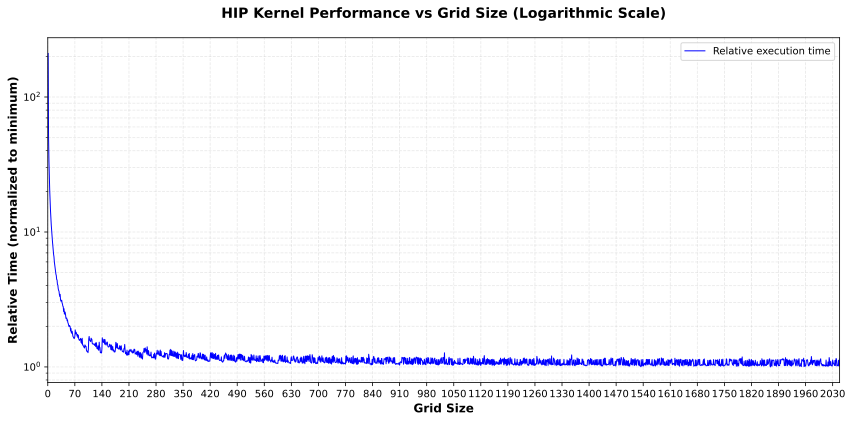

.. meta::
   :description: Fixed-size kernels for image gamma correction
   :keywords: HIP, ROCm, performance, optimization, gamma correction,
              grid-stride loop, kernel design

***********************************************************
Fixed-size kernels: image gamma correction
***********************************************************

In most of the examples presented thus far, each thread calculates a
single output element. This approach, while straightforward, introduces
performance bottlenecks that can be addressed through more efficient
kernel design patterns.

Addressing kernel dispatch overhead
====================================

Upon closer observation of one-thread-per-element implementations, you can
see that the overhead is high because for each output element, a thread must
be dispatched to the compute unit to calculate the global ID and check the
boundary conditions. This overhead becomes particularly significant in
memory-bound kernels where the actual computation per element is minimal
compared to the thread management costs.

To reduce this overhead, assign more tasks to each thread to amortize
the cost of launching threads on the GPU. Rather than changing the grid size
to grow with the input and output image, you can fix the number of workgroups
in the kernel and change the amount of work per thread according to the image
size. This approach, known as a *grid-stride loop* pattern, provides several
advantages:

- Reduced thread dispatch overhead through work amortization
- Consistent kernel launch configuration across different problem sizes
- Better resource utilization on the GPU
- Improved scalability for varying input dimensions

Grid-stride loop implementation
================================

This code sample reimplements the
:doc:`image gamma correction example <highly-parallel-image-gamma-correction>`
using a fixed-sized kernel with the grid-stride loop pattern.

.. literalinclude:: ../../tools/example_codes/grid_stride_image_gamma_correction.hip
   :language: CUDA
   :linenos:
   :start-at: hip_runtime.h
   :caption: GPU implementation of the image gamma correction using
             fixed-sized kernel patterns. The kernel is launched with
             a predefined size, and each thread is responsible for
             multiple pixels in the image.

This new implementation approximates the previous one but with two
minor modifications. First, it moves the boundary checking ``if``
statements in the kernel into a ``for`` loop. This allows each thread to
process multiple values and increment the index by the number of
threads in each iteration. For example, if you have 640 threads,
Thread 0 will process values with indices 0, 640, 1,280, and so on, and
Thread 1 will use indices 1, 641, 1,281, and so on. From this change, you
can set the number of threads, regardless of the problem size.

Performance characteristics and best practices
===============================================

Next, identify the best grid size to use. Examine the following
figure:

   Impact of grid size on image gamma program performance. The
   execution time is measured based on a 16,384 × 16,384 RGB image on
   a Radeon PRO W7800 GPU.

These measurements were taken on a Radeon™ PRO W7800 GPU using a 16,384 × 16,384
RGB image. The GPU has 35 work-group processors (WGPs), and each WGP can execute
up to 32 wavefronts concurrently.

At a high level, you observe three major trends:

* The performance improves as the number of workgroups increases because when
  there is a small number of workgroups, only a fraction of the compute units
  are used.
* The performance saturates around 1,400 workgroups, which provides
  approximately 10× oversubscription of the Radeon PRO W7800 GPU's capacity of
  1,120 maximum concurrent wavefronts (35 WGPs × 32 wavefronts). This
  oversubscription is necessary for effective latency hiding in this
  memory-bound kernel.
* A zig-zag pattern of execution times appears in the figure above. Sudden
  increases occur after multiples of 35. Given 35 workgroups, each WGP executes
  one workgroup in parallel; hence, they will likely finish at the same time. A
  few extra workgroups would not fully overlap with the first 35, but they
  would significantly increase the kernel execution time. This happens because
  although the last set of remaining workgroups might not be able to entirely
  utilize the GPU, they still have to do the same amount of work as the first
  set of workgroups. This effect, which is known as the *tail-effect*, is more
  pronounced when you have small grid sizes and should be avoided, if possible.

Key takeaways for optimal grid sizing
--------------------------------------

The experiment demonstrates that a fixed-sized kernel can effectively optimize
embarrassingly parallel implementations. When selecting grid sizes for your
kernels, consider the following best practices:

- Choose the smallest grid size that can fill all WGPs (RDNA GPUs in WGP mode)
  or compute units (RDNA GPUs in CU mode and CDNA GPUs) of the GPU.
- Always use a grid size that is a multiple of the WGP or CU count to avoid
  the tail-effect.
- Aim for sufficient oversubscription (approximately 10× in this example) to
  enable effective latency hiding in memory-bound kernels.
- Test different grid sizes empirically, as optimal values may vary based on
  the specific GPU architecture and workload characteristics.
