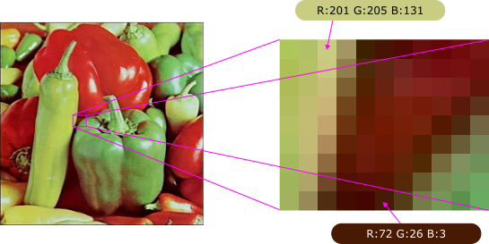

.. meta::
   :description: Learn how to optimize highly parallel workloads using image 
                 gamma correction as an example
   :keywords: HIP, ROCm, performance optimization, image processing, gamma 
              correction, embarrassingly parallel, GPU programming

*****************************************************
Highly parallel workload: image gamma correction
*****************************************************

A GPU typically has thousands of computing cores that run in parallel. These
cores are best utilized when each calculates one partition of the output
results so that they do not need to communicate with other cores. Such
algorithms are often classified as "embarrassingly parallel," as the
required programming effort is minimal. In the earlier ``vector_add``
example (see :doc:`/how-to/getting_started_with_hip_programming`), you
identified an embarrassingly parallel workload example. In this section, you
will explore another one: image gamma correction.

Computational challenges in pixel-wise operations
==================================================

.. subfigure:: ABCDE
   :layout-sm: A|B|C|D|E
   :gap: 20px
   :align: center
   :subcaptions: below
   :name: gamma_correction_examples

   .. image:: ../../data/tutorial/hip-performance-optimization/test_267x267.jpg
      :alt: Original
      :width: 96px
      :height: 96px

   .. image:: ../../data/tutorial/hip-performance-optimization/test_out_04_267x267.jpg
      :alt: Gamma = 0.4
      :width: 96px
      :height: 96px

   .. image:: ../../data/tutorial/hip-performance-optimization/test_out_08_267x267.jpg
      :alt: Gamma = 0.8
      :width: 96px
      :height: 96px

   .. image:: ../../data/tutorial/hip-performance-optimization/test_out_20_267x267.jpg
      :alt: Gamma = 2.0
      :width: 96px
      :height: 96px

   .. image:: ../../data/tutorial/hip-performance-optimization/test_out_40_267x267.jpg
      :alt: Gamma = 4.0
      :width: 96px
      :height: 96px

   Image gamma correction algorithm. A gamma value smaller than one renders
   the image more brightly, whereas a value greater than one renders a
   darker image.

Image gamma correction is a common image processing algorithm that adjusts
the brightness of an image without changing the content. As shown in the
figure above, when you apply a gamma value less than one, the image becomes
brighter, whereas a value greater than one darkens it.

Pictures stored on a computer are typically encoded using pixels (see
figure below), which are square regions of an image that are each rendered
with a single color. For example, the images used in the figures above and
below have 267 (width) × 267 (height) pixels total. If the image were colored,
three values representing red, green and blue (RGB) would be required for each
pixel, which represents the brightness. Brightness is coded using an 8-bit
integer [0–255], where zero represents the darkest, and 255 represents the
brightest. The other key method uses a floating-point number between zero
and one. The red brightness values of all pixels comprise the "red
channel," and a colored image typically has three channels (RGB).

         sample pixels

   Computerized image organized using pixels. A color image usually requires
   RGB brightness values to represent the final pixel color.

.. math::

   V_{out} = V_{in}^{\gamma}

Image gamma correction is an element-wise operation that applies simple
floating-point manipulation to all pixels and their channels. As shown in
the equation above, the gamma value is applied as a power to the brightness
value. A greater-than-one gamma decreases the brightness value. As
suggested by the equation, the number of output values matches the number
of input values, and the calculation of each output value is independent of
the calculation of neighboring values. The image gamma correction algorithm
is embarrassingly parallel; thus, it is suitable for GPUs.

GPU kernel design and optimization strategies
==============================================

The following listing presents a simple implementation of the gamma
correction algorithm using HIP.

.. literalinclude:: ../../tools/example_codes/basic_image_gamma_correction.hip
   :language: CUDA
   :linenos:
   :start-at: #include <hip/hip_runtime.h>
   :caption: Image gamma correction application as an embarrassingly parallel
             algorithm. Each thread is responsible for processing a value in
             the array of image pixels. The grid size reflects their number.

To address this GPU programming problem, you must first consider how to map
the threads to the input and output elements. For embarrassingly parallel
algorithms, the mapping is straightforward, as each thread is responsible
for a part of the output channel (a pixel). Therefore, the total number of
threads will equal the height × width × number of channels = ``num_values``.
To calculate the grid size, you divide ``num_values`` by the block size. If
the block size is not a multiple of ``num_values``, you can round up to the
next integer, as shown in line 23 of the listing above.

The block size can be between 1 and 1,024, depending on the device
limitation. Note that selecting a suitable block size will improve the
overall performance. According to the figure below, the performance is best
when the block size is a multiple of 32, because RDNA GPUs organize groups of
32 threads in a wavefront, which is the smallest resource allocation unit.

.. note::
   On CDNA GPUs, the wavefront size is 64.

Otherwise, the CUs will be forced to allocate more resources for each
block, resulting in performance degradation. The selection of the block size
as a multiple of the wavefront size is likely to optimize embarrassingly
parallel applications with AMD GPUs.

.. figure:: /data/tutorial/hip-performance-optimization/bench_block_size_plot.svg
   :alt: Graph showing impact of block size on program performance with
         relative execution time on y-axis and block size on x-axis

   Impact of block size on program performance. The image gamma correction
   execution time reflects a 16,384 × 16,384 RGB image on a Radeon PRO W7800
   GPU.

Performance benefits and application patterns
==============================================

The GPU implementation of image gamma correction demonstrates significant
performance advantages over CPU-based approaches. By leveraging thousands of
parallel threads, you can process millions of pixels simultaneously, making
this technique particularly effective for high-resolution images and
real-time video processing applications.

The embarrassingly parallel nature of gamma correction makes it an ideal
candidate for GPU acceleration. Similar patterns appear in many other image
processing operations, including:

- Color space conversions (RGB to grayscale, HSV transformations)
- Brightness and contrast adjustments
- Image filtering with separable kernels
- Histogram equalization
- Pixel-wise arithmetic operations

When you encounter algorithms where each output element depends only on a
corresponding input element (or a small, fixed neighborhood), consider
applying the same parallelization strategy demonstrated here. The key
characteristics that make a workload suitable for this approach include:

- Independent calculations for each output element
- Minimal or no inter-thread communication requirements
- Regular memory access patterns
- Sufficient computational work per thread to offset kernel launch overhead

By understanding these patterns and optimization techniques, you can
effectively accelerate a wide range of image processing and data-parallel
workloads on AMD GPUs using HIP.
