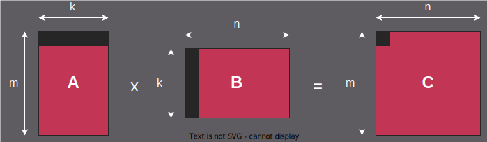

.. meta::
  :description: HIP tiling matrix multiplication tutorial
  :keywords: AMD, ROCm, HIP, matrix multiplication, tiling, performance, tutorial

*************************************************************
Tiling & Reuse - Matrix Multiplication
*************************************************************

Matrix multiplication is one of the most important GPU workloads as it supports
many computational problems. With the increased popularity of deep
neural networks (DNNs), matrix multiplication has become vital and is found
in the most computationally-intensive layers (i.e., fully connected and
convolutional) of neural networks. In some cases, you might want to convert a
problem to use matrix multiplications because GPUs are optimized to efficiently
execute matrix multiplication, and to outperform an iterative implementation of
the original problem.

Matrix multiplication fundamentals
==================================

A matrix multiplication operation involves three matrices, A, B, and C.
Matrices A and B are input matrices, and matrix C is the output matrix.
You can denote matrix A as having m rows and k columns and matrix B as having
k rows and n columns. Matrix multiplication operations require the number of
columns in A to equal the number of rows in B. Output matrix C then inherits
m rows and n columns. Each element in C is the sum of the k multiplications
of each element in the corresponding row of A and column of B, as formally
represented in the figure below:

An iterative CPU implementation will apply three nested loops that traverse
through m, n, and k. Each iteration will perform single multiplication and
accumulation operations. Therefore, theoretically, a total of 2 × m × n × k
operations are required.

A GPU implementation by comparison is embarrassingly parallel. The GPU
kernel parallelizes the m and n loops by calculating each element in the
output matrix using a thread. Thus, you need a total of m × n threads,
with each traversing a loop of k iterations.

Naive implementation and memory access patterns
===============================================

Although the naive implementation produces the correct result, the resulting
performance is not ideal. Profiling the kernel execution shows that it reads
from the GPU's Dynamic Random Access Memory (DRAM) several times more often
than the combined size of the input matrices. To further explore this issue,
you must examine how the threads read the input matrices.

In the naive implementation, each thread in the kernel reads an entire row
in matrix A and a column in matrix B. The same data item must be accessed
by multiple threads from different wavefronts. In the naive implementation,
all memory reads are handled by the main memory system, and although there
are repeated memory references made to the same location, these memory
accesses should instead be serviced by the cache. However, given the limited
cache space and the large number of threads involved, this places inordinate
memory pressure on the caches. Then, as you increase the matrix size, the
caches will become incapable of accommodating the data and memory reads,
which will quickly push the data to the main memory, causing significant
delays.

Ideally, you want to have more control over caches. When data are loaded
into the cache, it should be reused by as many threads as possible before
being released. In CPU programming, caches are fully transparent to the
programmer and are typically not under their control. In contrast, GPUs
provide Local Data Store (LDS) memory, which is effectively a programmable
L1 cache.

.. literalinclude:: ../../tools/example_codes/tiling_matrix_multiply.hip
   :language: cuda
   :linenos:
   :start-after: [Sphinx HIP matrix multiplication naive kernel start]
   :end-before: [Sphinx HIP matrix multiplication naive kernel end]

LDS tiling optimization
=======================

To improve matrix multiplication performance, and make better use of LDS,
you apply a common GPU programming technique called "tiling." Tiling methods
use all threads from a workgroup to collectively process parts of the data
before moving to the next portion of the problem. The first workgroup loads
the data of matrices A and B in a tile to the LDS. Then, matrix multiplication
is applied to the loaded tile. Next, the wavefronts move to the next tile,
continuing to accumulate multiplication results.

The LDS tiling-based kernel implementation uses LDS memory to dramatically
reduce global memory access. The kernel's interface is identical to the
native implementation. The only special requirement is that the tile size
parameter must be defined to determine the number of elements in each of the
two dimensions to group into a single tile. The workgroup size must match
the tile size to help ensure the correctness of the output.

.. literalinclude:: ../../tools/example_codes/tiling_matrix_multiply.hip
   :language: cuda
   :linenos:
   :start-after: [Sphinx HIP matrix multiplication LDS tiling kernel start]
   :end-before: [Sphinx HIP matrix multiplication LDS tiling kernel end]

The kernel implementation must be modified to use two loops, rather than
just one. The outer loop addresses memory across the tile, and the inner
loop accumulates multiplications. Before the loop starts, you allocate two
buffers for the tiles for matrices A and B. In each iteration of the outer
loop, you load the data from the main memory to the LDS. Here, the complexity
of the implementation mainly comes from the index calculation and boundary
checking. Next, you use the inner loop in a way similar to the naive
implementation to perform multiplication and accumulation. Note that you need
barriers before and after the inner loop to guarantee that all data are
loaded and used, respectively. Finally, you store the final result in the
output matrix.

LDS tiling is an effective way to reduce DRAM access and improve performance.
Performance improvements with tiling depend on the specific GPU architecture
and matrix dimensions, but significant speedups over the naive implementation
are commonly observed on AMD GPUs.

Register tiling: The next optimization step
===========================================

After implementing LDS tiling, the next optimization step is register tiling.
While LDS tiling reduces global memory traffic by caching tiles in shared
memory, register tiling further reduces memory traffic by keeping frequently
accessed data in thread-local registers. This approach eliminates the need
for many shared memory reads within the inner computation loop.

Register tiling works by having each thread compute multiple output elements
and load the necessary input data into registers. The computation then
proceeds using only register-to-register operations, with minimal shared
memory access. This technique is particularly effective because register
access is significantly faster than shared memory access, each thread has
private registers eliminating bank conflicts, synchronization overhead between
threads is reduced, and better instruction-level parallelism can be achieved.

The register tiling kernel uses a more complex thread-to-data mapping where
each thread computes a small tile of output elements (typically 4 × 4) and
loads the required input data into registers before performing the
multiplication.

.. literalinclude:: ../../tools/example_codes/tiling_matrix_multiply.hip
   :language: cuda
   :linenos:
   :start-after: [Sphinx HIP matrix multiplication register tiling kernel start]
   :end-before: [Sphinx HIP matrix multiplication register tiling kernel end]

The register tiling implementation introduces thread tile computation,
where each thread computes multiple output elements (defined by ``thread_tile_m``
and ``thread_tile_n`` parameters), and register-based accumulation, where
intermediate results are stored in registers instead of shared memory.
Threads also use efficient data loading, loading data cooperatively into
shared memory and then copying to registers for computation.

This approach typically provides additional performance improvements beyond
LDS tiling. The actual speedup will vary based on GPU architecture, matrix
dimensions, and other factors.

Practical implementation considerations
=======================================

When implementing these optimizations for your specific application, consider
the following factors:

* **Matrix dimensions**: The effectiveness of tiling depends on how well the
  matrix dimensions align with tile sizes and GPU compute unit resources

* **Memory requirements**: Larger tiles may not fit in available LDS space,
  requiring careful tuning of tile dimensions

* **GPU architecture**: Different AMD GPU architectures have varying LDS
  capacities and register availability, affecting optimal tile sizes

* **Workload characteristics**: Some applications may benefit more from
  LDS tiling alone, while others justify the added complexity of register
  tiling

Choosing the right optimization approach depends on your specific performance
requirements, target hardware, and implementation complexity constraints.
